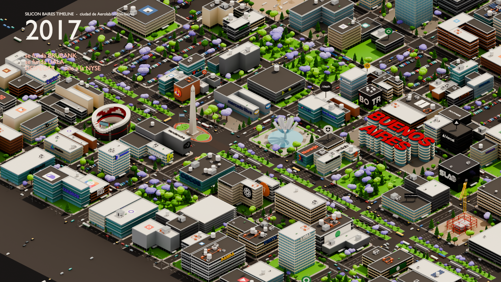
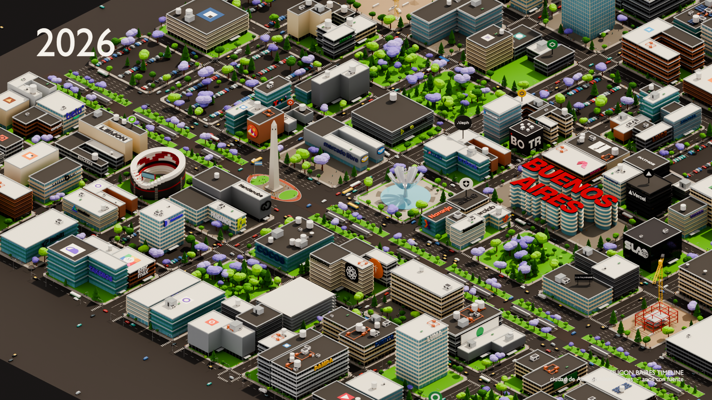

# Silicon Baires, año por año

[silicon-baires](https://github.com/Aerolab/silicon-baires), de Aerolab, es una
Buenos Aires isométrica generada por Python en Blender headless, con carteles de
empresas reales por los techos y las medianeras. Su pieza es un travelling de 24
segundos: la cámara recorre la ciudad y la ciudad está entera desde el primer
fotograma.

Esto invierte las dos cosas. **La cámara se clava y lo que se mueve es el año.**
Cada cartel cuya empresa tiene año de fundación citable arranca apagado y se
prende en su año, de 1995 a 2026. El tránsito y la gente siguen andando, así que
la ciudad está viva mientras el ecosistema se va llenando.



## Qué agrega este repo

Nada de la ciudad. La geometría, los materiales, la luz, los logos, los autos y
los peatones son de Aerolab y no están acá: `fetch_upstream.sh` los trae fijados
a un commit. Lo que hay es la capa de tiempo:

| Archivo | Qué hace |
|---|---|
| [`scripts/timeline_layer.py`](scripts/timeline_layer.py) | Congela la cámara, reencuadra sobre los carteles con año, los apaga y los va prendiendo, y arma el HUD |
| [`data/brand_years.json`](data/brand_years.json) | El año de fundación de cada marca de su ciudad, con fuente y nivel de confianza una por una |
| [`scripts/fetch_upstream.sh`](scripts/fetch_upstream.sh) | Clona silicon-baires fijado a `963da31` |
| [`scripts/make_video.sh`](scripts/make_video.sh) | Los 608 fotogramas y el MP4 |

## La regla: sin fuente no hay línea de tiempo

Su ciudad reparte **72 marcas**. **22 se animan**, porque pudimos citar el año.
Las otras 50 no reciben una fecha inventada: se quedan visibles desde el primer
fotograma, exactamente como las dejó upstream. Son dos grupos y ninguno es un
descuido:

- **Inventadas por ellos.** Su propio `scripts/city/_brands.py` declara que las
  últimas de su tabla existen para llenar la ciudad — ANDA, CEIBO, FERNET,
  PAMPA, QUILME, TANGO, YERBA y veintiséis más. No existen, no hay año que
  buscar.
- **Reales sin fuente.** BASEMENT, BELO, COCOS, COMPLIF, DECENTRALAND, GALICIA,
  HUMAND, MASLOW, MERCADO PAGO, MODO, NARANJA X, OPENZEPPELIN, PAISANOS, PATMOS,
  REBILL, REVAMOS, SLA, TAKENOS. Existen, pero no encontramos año citable.

Las 22 que sí:

| Año | Marca | Año | Marca |
|---|---|---|---|
| 1995 | Technisys | 2012 | Aerolab |
| 1999 | Mercado Libre | 2013 | Auth0, Ripio |
| 1999 | Despegar | 2014 | Coderhouse |
| 2001 | Bioceres | 2015 | Vercel |
| 2003 | Globant | 2016 | Digital House |
| 2005 | Aleph | 2017 | Ualá, Brubank |
| 2006 | OLX | 2019 | Lemon |
| 2009 | etermax | 2021 | Pomelo |
| 2010 | Satellogic | | |
| 2011 | Mural, Tiendanube | | |

Cada una lleva `confidence`: `confirmed` si el año está en Wikipedia o en la
propia empresa, `reported` si sólo aparece en prensa o bases de terceros,
`conflicting_sources` cuando no coinciden. Tiendanube figura como 2010 y como
2011 según dónde se mire: se usó 2011 y quedó anotado. Bioceres es de Rosario y
Vercel se fundó afuera; las dos están marcadas en el JSON.

Los hitos posteriores —Mercado Libre en Nasdaq 2007, Naspers tomando OLX 2010,
Preguntados 2013, Globant en la NYSE 2014, Okta comprando Auth0 en 2021—
aparecen en **su** año, no en el de fundación de la empresa.

## Cómo se corre

```bash
./scripts/fetch_upstream.sh
```

```bash
blender -b upstream/renders/city.blend -P scripts/timeline_layer.py -- --repo .
```

```bash
./scripts/make_video.sh
```

`timeline_layer.py` es idempotente: borra todo lo que empieza con `TL_` antes de
construir. Y no toca el `.blend` de upstream — lee el suyo y guarda una copia en
`scene_city/`.

## La cámara no se mueve

Congelarla no es borrar una animación, son dos. El objeto tiene la del
travelling, y **el dato de cámara tiene la del zoom**: upstream anima
`ortho_scale` de 306 a 170. Limpiar sólo la del objeto deja la cámara quieta y
el encuadre cerrándose igual, que es justo lo que esta pieza no quiere.

El encuadre tampoco es el de ellos. Su plano final lo ocupan las letras rojas de
BUENOS AIRES; acá lo que hay que ver son los carteles. Así que la cámara se
congela en el **ángulo** de su plano de apertura y se reencuadra sobre la caja de
los 22 carteles con año — medida en el plano de la cámara, no en los ejes del
mundo, porque un bounding box alineado al mundo no dice nada sobre cuánto
`ortho_scale` hace falta.

Encuadrar la ciudad entera, en cambio, la deja como una isla chica en medio del
fondo y no se lee ni un logo. Se probó:



`scene_city/timeline_report.json` guarda la pose resultante, el `ortho_scale` y
`"keyframes": 0`.

## Notas

- **Blender 5 sacó `Action.fcurves`.** Las acciones ahora tienen slots y capas,
  así que recorrer las curvas después de insertar ya no funciona: la
  interpolación se fija en las preferencias antes del `keyframe_insert`.
- **El HUD iba a profundidad 600 y las torres lo tapaban.** Está parentado a la
  cámara, así que la profundidad es local: 8 unidades y se resuelve.
- **5 de las 100 entradas del manifiesto no tienen objeto en el `.blend`**, y el
  informe lo dice en vez de fallar en silencio.

## Crédito

La ciudad es de [**Aerolab/silicon-baires**](https://github.com/Aerolab/silicon-baires),
© 2026 Aerolab, licencia ISC. Este repo sólo le agrega la capa de tiempo, bajo
MIT — ver [LICENSE](LICENSE).
